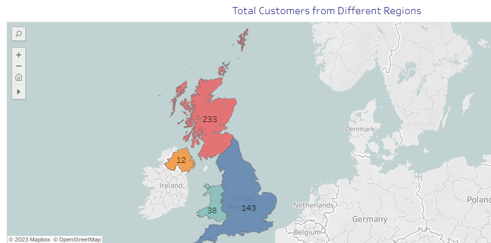
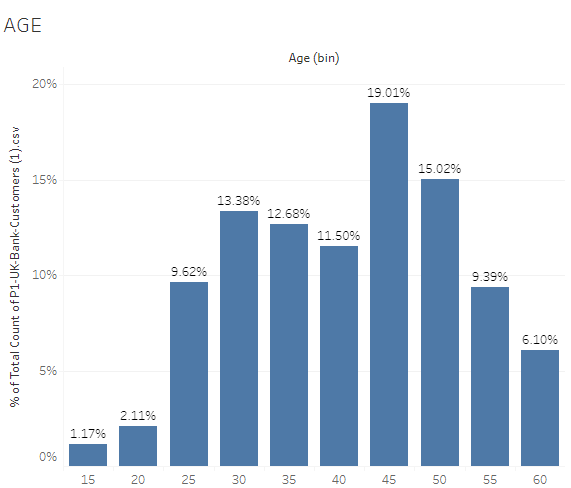
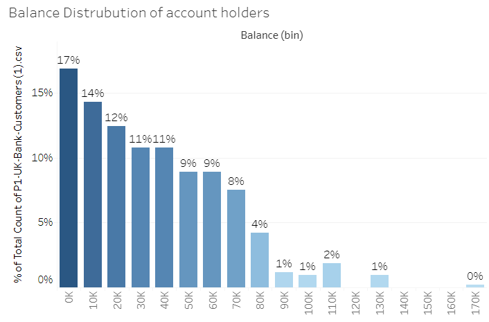
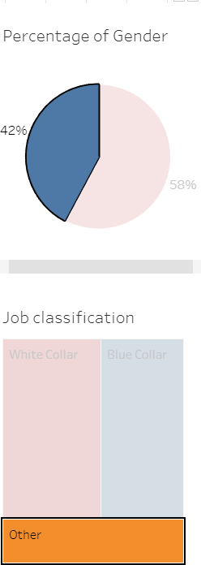
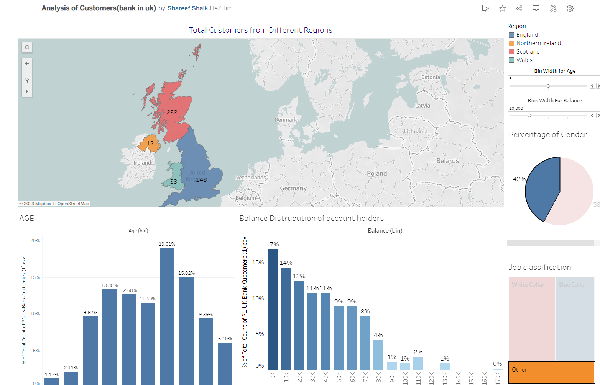

# Bank Customer Insights Dashboard

Welcome to the Bank Customer Insights Dashboard repository! This dashboard provides a comprehensive overview of customer data for a bank operating in four different regions: England, Northern Ireland, Scotland, and Wales. The dashboard utilizes Tableau for data visualization and analysis, enabling us to gain valuable insights into various aspects of the bank's customer base.

## Introduction

In today's competitive financial landscape, understanding customer demographics, behaviors, and preferences is crucial for making informed business decisions. This Tableau dashboard is designed to offer a visual representation of the bank's customer data, allowing stakeholders to explore key insights and answer important questions related to customer distribution, age groups, account balances, occupations, and gender distribution.

## Visualizations and Insights

1. **Customer Distribution by Region**
   - Visualization: A bar chart displaying the number of customers in each of the four regions.
   - Insights: Identify which regions have the highest and lowest customer counts, aiding in regional targeting and resource allocation.
   

2. **Customer Age Groups**
   - Visualization: A bar chart depicting the number of customers in different age groups.
   - Insights: Understand the age distribution of customers and tailor marketing strategies or product offerings accordingly.
   

3. **Balance Distribution**
   - Visualization: A histogram showcasing the distribution of customer account balances.
   - Insights: Analyze the distribution of account balances to identify potential high-net-worth customers or those with lower balances.
   

4. **Occupation and Gender Analysis**
   - Visualization: A grouped bar chart representing the distribution of customers based on their occupations and gender.
   - Insights: Gain insights into both the primary occupations of customers and the gender distribution, aiding in targeted financial product development.
   

## Potential Questions Answered

1. How does the customer count vary across different regions?
2. Which age groups make up the largest segment of the customer base?
3. What is the distribution of account balances among customers?
4. What are the most common occupations among bank customers, and how does gender vary across occupations?

## Implementation Techniques

- Data Integration: The dashboard integrates customer data from different regions and sources to provide a comprehensive view.
- Filters: Interactive filters enable users to refine the data and focus on specific regions, age groups, occupations, or gender.
- Linked Visualizations: Certain graphs serve as filters for other visualizations, allowing for dynamic data exploration.
- Data Aggregation: The histogram and bar charts utilize data aggregation techniques to showcase distribution patterns.
- Color Coding: Strategic use of colors enhances visual appeal and facilitates data interpretation.
- Grouped Bar Chart: The combined occupation and gender analysis is effectively visualized using a grouped bar chart.

## How to Access the Dashboard

To explore the Bank Customer Insights Dashboard, please follow this [link](https://public.tableau.com/views/AnalysisofCustomersbankinuk/Dashboard1?:language=en-US&:display_count=n&:origin=viz_share_link).

## Conclusion

The Bank Customer Insights Dashboard provides a user-friendly and intuitive interface to explore essential customer data. By leveraging Tableau's visualization capabilities, stakeholders can quickly identify trends, make data-driven decisions, and uncover valuable insights that drive the bank's success.
